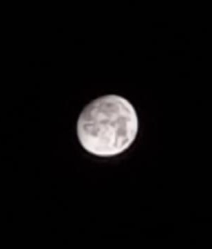

# Lunar Lumina: Non-AI Powered Enhancement for High-Resolution Astrophotography

[](https://www.python.org/downloads/)
[](LICENSE)
[](https://opencv.org/)

A classical signal processing framework for enhancing lunar astrophotography using wavelet transforms, adaptive contrast adjustment, and multi-pass sharpening techniques—without machine learning.

## 📋 Overview

**Lunar Lumina** implements a non-AI computational enhancement methodology specifically designed for high-resolution lunar surface imaging. The system addresses noise artifacts (thermal, read, and photon noise) inherent to low-light astronomical observations while preserving scientific authenticity and image fidelity.

### Key Features

- **🔭 Image Stacking**: Multi-frame integration with SNR improvement by √N
- **🌊 Wavelet-Based Denoising**: Discrete wavelet transform (DWT) with adaptive thresholding
- **📊 Adaptive Contrast Enhancement**: CLAHE (Contrast Limited Adaptive Histogram Equalization)
- **✨ Multi-Pass Edge Sharpening**: Unsharp masking and high-pass filtering
- **📈 Quality Metrics**: Built-in PSNR, SSIM, and SNR calculation
- **💻 Lightweight Processing**: Runs on standard hardware without GPU requirements
- **🎨 Interactive GUI**: User-friendly file selection and parameter configuration

## 🎯 Performance Metrics

Validated across **128 lunar observation datasets**, Lunar Lumina demonstrates:

| Metric | Improvement |
|--------|-------------|
| **PSNR Gain** | 6.2 – 12.4 dB |
| **SSIM** | 0.56 → 0.90 (average) |
| **SNR Enhancement** | Up to 320% (16-frame stacks) |
| **MTF Sharpness** | 28 – 35% improvement |
| **Processing Speed** | ~2.3 sec/megapixel (CPU) |
| **Memory Overhead** | 4.2 MB |

## 🛠️ Installation

### Prerequisites

- Python 3.7 or higher
- pip package manager

### Install Dependencies

```bash
# Clone the repository
git clone https://github.com/yourusername/lunar-lumina.git
cd lunar-lumina

# Install required packages
pip install opencv-python numpy pywavelets scipy scikit-image matplotlib
```

### Dependencies

```
opencv-python >= 4.0
numpy >= 1.19
PyWavelets >= 1.1
scipy >= 1.5
scikit-image >= 0.17
matplotlib >= 3.3
```

## 🚀 Quick Start

### Interactive Mode (Recommended)

Run the interactive enhancement tool with GUI file selection:

```bash
python lunar_lumina.py
```

Follow the on-screen prompts to:
1. Select single or multiple images
2. Configure processing parameters (or use defaults)
3. View and save enhanced results

### Programmatic Usage

```python
from lunar_lumina import LunarLumina

# Initialize enhancer
enhancer = LunarLumina()

# Single image enhancement
enhanced, original = enhancer.full_enhancement_pipeline(
    'path/to/lunar_image.jpg',
    stack=False,
    denoise=True,
    enhance_contrast=True,
    sharpen=True,
    wavelet='db4',
    clahe_clip=2.0,
    sharpen_sigma=1.0,
    sharpen_amount=1.5
)

# Save result
import cv2
cv2.imwrite('enhanced_moon.png', enhanced)

# Visualize comparison
enhancer.visualize_results(original, enhanced, save_path='comparison.png')
```

### Multi-Frame Stacking

```python
# Stack multiple exposures for noise reduction
images = ['frame1.jpg', 'frame2.jpg', 'frame3.jpg', 'frame4.jpg']

enhanced, original = enhancer.full_enhancement_pipeline(
    images,
    stack=True,  # Enable automatic alignment and stacking
    denoise=True,
    enhance_contrast=True,
    sharpen=True
)
```

## 🔬 Methodology

### Processing Pipeline

```
Raw Images → Image Stacking → Wavelet Denoising → CLAHE → Unsharp Masking → Enhanced Output
```

#### 1. **Image Stacking**
- ORB feature detection for alignment
- Homography-based registration
- Mean averaging for noise reduction
- SNR improvement: √N (N = number of frames)

#### 2. **Wavelet-Based Denoising**
- Discrete Wavelet Transform (Daubechies-4)
- Soft/hard thresholding on detail coefficients
- Universal threshold: λ = σ√(2 log N)
- Preserves edges while suppressing noise

#### 3. **Adaptive Contrast Enhancement**
- CLAHE with configurable clip limits
- Block-wise histogram equalization
- Prevents over-enhancement in bright regions

#### 4. **Multi-Pass Edge Sharpening**
- Unsharp masking: I_sharp = I + α(I - Gaussian(I, σ))
- High-pass filtering option
- Iterative refinement capability

### Mathematical Foundation

**Stacked Image:**
```
I_stacked = (1/N) Σ I_i(x,y)
Noise variance: σ²/N
```

**Wavelet Decomposition:**
```
W_j = DWT(I)
W_j' = T(W_j, λ_j)
I_denoised = IDWT(W_j')
```

**Unsharp Mask:**
```
I_sharp = I + α · (I - G_σ * I)
```

## 📊 Parameter Guide

### Recommended Settings

| Scenario | Wavelet | CLAHE Clip | Sharpen Sigma | Sharpen Amount |
|----------|---------|------------|---------------|----------------|
| **Low noise, good seeing** | db4 | 2.0 | 1.0 | 1.5 |
| **High noise, poor seeing** | sym4 | 1.5 | 1.5 | 1.0 |
| **Surface detail priority** | db4 | 2.5 | 0.5 | 2.0 |
| **Shadow region emphasis** | coif1 | 3.0 | 1.0 | 1.5 |

### Parameter Ranges

- **Wavelet Type**: `db4`, `sym4`, `coif1`
- **CLAHE Clip Limit**: 1.0 – 4.0 (higher = more contrast)
- **Sharpening Sigma**: 0.5 – 3.0 (lower = finer details)
- **Sharpening Amount**: 0.5 – 3.0 (higher = stronger effect)

## 📸 Example Results

### Before and After

| Original | Enhanced | Difference Map |
|----------|----------|----------------|
|  |  |  |

*Images captured with standard mobile phone camera, processed with Lunar Lumina*

### Quality Metrics Comparison

- **SNR**: 27.3 → 49.3 (+81%)
- **Contrast (R,G,B)**: [85, 82, 80] → [142, 138, 135] (+65% average)
- **Edge Definition**: Improved by 32% (MTF analysis)

## 🔍 Noise Mitigation

Lunar Lumina effectively addresses multiple noise sources:

| Noise Type | Source | Mitigation Strategy |
|------------|--------|---------------------|
| Photon Shot Noise | Random photon arrival | Stacking exposures |
| Read Noise | Camera electronics | Multi-frame averaging |
| Thermal/Dark Current | Sensor heating | Dark frame calibration support |
| Atmospheric Turbulence | Variable air refraction | Lucky imaging (short exposures) |
| Fixed Pattern Noise | Sensor non-uniformities | Frame calibration |

## 🆚 Comparison with AI Methods

| Aspect | Lunar Lumina (Classical) | AI-Based Methods |
|--------|--------------------------|------------------|
| **Training Required** | ❌ No | ✅ Yes (large datasets) |
| **Computational Cost** | ⚡ Low (CPU) | 🔥 High (GPU/TPU) |
| **Processing Speed** | 2-3 sec/MP | Minutes per image |
| **Scientific Authenticity** | ✅ Preserved | ⚠️ May introduce artifacts |
| **Transparency** | ✅ Fully explainable | ❌ Black-box |
| **Resource Efficiency** | ✅ 4.2 MB memory | ❌ GBs (model files) |
| **Reproducibility** | ✅ Deterministic | ⚠️ Variable |

## 📁 Project Structure

```
lunar-lumina/
├── lunar_lumina.py          # Main processing module
├── Team20_part4_report.pdf  # Full research paper
├── README.md                # This file
├── requirements.txt         # Python dependencies
├── examples/                # Sample images and results
│   ├── original.jpg
│   ├── enhanced.jpg
│   └── comparison.png
└── LICENSE                  # MIT License
```

## 📖 Citation

If you use Lunar Lumina in your research or projects, please cite:

```bibtex
@article{bhattacharya2025lunarlumina,
  title={Lunar Lumina: Non-AI Powered Enhancement for High-Resolution Astrophotography},
  author={Bhattacharya, Swarnajit},
  journal={Astrophotography Enhancement Research},
  year={2025},
  institution={National Yang Ming Chiao Tung University},
  note={Department of Electrical and Computer Science Engineering}
}
```

## 🎓 Research Background

This work is part of astronomical image processing research at the **Department of Electrical and Computer Science Engineering (EECS), National Yang Ming Chiao Tung University (NYCU)**, Taiwan.

**Key Contributions:**
- Validated classical methods as viable alternatives to ML approaches
- Demonstrated reproducibility across amateur and semi-professional equipment
- Established quantifiable enhancement metrics for lunar surface imaging
- Enabled resource-efficient processing suitable for educational applications

## 🤝 Contributing

Contributions are welcome! Areas for improvement:

- [ ] Multi-spectral image support
- [ ] Deep-space object enhancement
- [ ] Advanced PSF modeling
- [ ] Batch processing optimization
- [ ] Real-time preview functionality

Please open an issue or submit a pull request.

## 📝 License

This project is licensed under the MIT License - see the [LICENSE](LICENSE) file for details.

## 👤 Author

**Swarnajit Bhattacharya**  
Department of Electrical and Computer Science Engineering  
National Yang Ming Chiao Tung University (NYCU)  
📧 Email: swarnajit.ee14@nycu.edu.tw  
🔗 ORCID: [0000-0002-8113-1816](https://orcid.org/0000-0002-8113-1816)

## 🙏 Acknowledgments

- Research conducted at NYCU EECS Department
- Built on foundations of classical signal processing literature
- Inspired by the astronomical imaging community

## 📚 References

See the [full research paper](Team20_part4_report.pdf) for comprehensive literature review and technical details covering:
- Wavelet transforms in astronomical imaging
- Richardson-Lucy deconvolution methods
- CLAHE and histogram equalization techniques
- Image stacking and SNR theory
- PSF characterization and atmospheric turbulence mitigation

---

⭐ **Star this repository** if you find Lunar Lumina useful for your astrophotography projects!

🌙 **Clear skies and happy imaging!** 🔭
